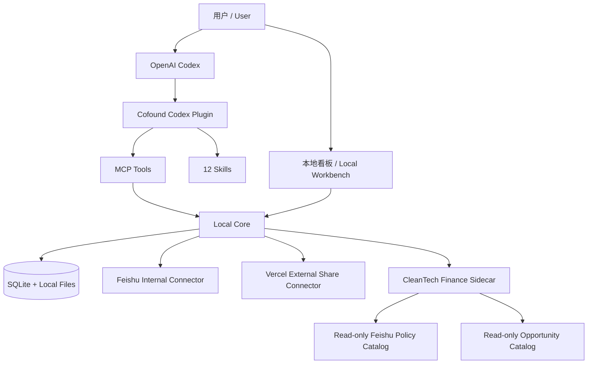

# Cofound Investment Office

> 面向 OpenAI Codex 的本地优先投资工作台与可扩展 Agent 插件。  
> A local-first, Codex-native investment workbench and extensible agent plugin.

Cofound Investment Office 面向天使、Pre-A 与 A 轮项目，把 BP 与补充材料导入、确定性事实提取、证据定位、投资判断、项目看板和受控协作放在同一个本地工作空间中。用户可以在 Codex 中直接用自然语言操作，也可以通过浏览器看板查看和确认结果。

这是一个独立开源项目，不隶属于 OpenAI、DeepSeek 或 Nous Research，也未获得上述组织的官方背书。`cofound-bp-desk` 是为兼容现有安装保留的内部插件 ID；对外产品名称统一为 **Cofound Investment Office**。

## 核心原则

- **Codex first**：自然语言是主入口，看板负责可见、校对和确认。
- **Local first**：完整项目、原件、事实、判断历史和管理状态默认留在本机。
- **事实与判断分层**：程序整理金额、日期、轮次和页码证据；Codex 负责开放式商业判断。
- **证据优先**：结构化判断绑定文件 Hash、事实快照、操作者、模型、Skill 和提示词版本。
- **连接器可选**：不配置飞书、Vercel 或 CleanTech 时，本地 BP 管理和分析仍可独立运行。
- **外部写入需确认**：发布、飞书写入、状态变更和产品代码迭代均需明确授权。

## 架构



本地核心始终是项目主系统。飞书只负责企业内部原件与协作索引；Vercel 只承接管理员选择后的单项目外部分享；CleanTech Finance 作为可选侧车保留其权威规则和数据治理。

## 已有能力

- 导入 PDF、DOCX、PPTX、TXT、Markdown 与常见补充材料；
- 本机中英文 OCR、SHA-256 去重、文件版本链和本地回收站；
- 确定性事实字段、页码证据、固定歧义规则、风险与信息缺口；
- 按轮次、行业、日期、订单、LOI、收入和项目状态筛选；
- 自定义项目字段、AI 状态与人工状态分离、人工判断锁定；
- Codex 开放式问答、结构化分析留档、事实变化后的过期提醒；
- BP 问题诊断、投资逻辑增强和证据约束的 BP 优化；
- 飞书企业共享目录的追加归档、团队收件箱、幂等同步与读回校验；
- 选择字段和文件版本后发布独立外部链接，使用 6 位访问码访问；
- 浏览器内 inline 文件预览、页码导航、昵称批注、回复和解决状态；
- 产品问题诊断与维护者审核后的代码迭代工作流；
- 可选 CleanTech 财务证据、上海政策和欧洲/巴西项目机会匹配。

## 12 个内置 Skills

| 类别           | Skill                                   | 用途                                                         | 自动性与写入边界                        |
| -------------- | --------------------------------------- | ------------------------------------------------------------ | --------------------------------------- |
| 主入口         | `analyze-local-bp`                      | 理解用户目标，读取项目和证据，自由讨论、检索、反证与增强判断 | 默认入口；不因对话自动发布或改状态      |
| 核心筛选       | `review-early-stage-investment`         | 天使、Pre-A、A 轮证据优先初筛                                | 按需调用，结果需人工判断                |
| 市场视角       | `assess-market-first`                   | 市场空间、拐点、竞争与替代风险                               | 可选视角                                |
| 创始人视角     | `assess-founder-first`                  | 创始人与团队、执行力、抗压和匹配度                           | 可选视角                                |
| 长期价值       | `assess-long-term-value`                | 产业价值、长期竞争力和经营质量                               | 可选视角                                |
| BP 优化        | `improve-investment-bp`                 | 根据证据缺口和逻辑问题提出 BP 修改方案                       | 不覆盖原件                              |
| CleanTech 路由 | `enhance-cleantech-project`             | 在财务、政策和项目机会能力之间选择一项                       | 仅显式请求时运行                        |
| CleanTech 财务 | `review-cleantech-financial-evidence`   | 离线财务证据与现金跑道审计                                   | 可选侧车，不调用模型或飞书              |
| CleanTech 政策 | `match-shanghai-cleantech-policies`     | 飞书政策主库的上海政策候选匹配                               | 用户态只读；非适用返回 `not_applicable` |
| CleanTech 机会 | `match-cleantech-project-opportunities` | 欧洲/巴西项目、采购和招标候选匹配                            | 用户态只读；不刷新外部 API              |
| 问题诊断       | `diagnose-cofound-feedback`             | 复现、定位并整理用户反馈                                     | 不自动修改正式代码                      |
| 正式迭代       | `iterate-cofound-product`               | 维护者审核后执行产品改动与验证                               | 需要人工批准                            |

Skills 只是可替换的专业方法，不限制普通 Codex 对话。用户仍可以针对当前 BP 自由提问、提出自己的假设、调用其他已安装能力，或新增自己的 Skill。

## 三分钟安装（Windows）

前置条件：Windows 10/11、Node.js 24、Codex 桌面应用。

```powershell
git clone https://github.com/wulie0508-gif/cofound-investment-office.git
cd cofound-investment-office
```

第一次使用双击 `Install-Cofound-Desktop-Shortcut.cmd`。安装程序会：

1. 按锁文件安装依赖；
2. 注册仓库内的 `cofound-bp-desk` Codex Plugin；
3. 创建桌面入口与当前用户开机自启；
4. 打开 `http://127.0.0.1:4010` 并拉起 Codex。

安装或更新插件后请新建一个 Codex 对话，然后直接说：

> 查看 Cofound 当前项目，告诉我今天优先处理什么。

完整的非技术使用说明见 [领导开始使用](LEADER_START_HERE.md)。

## 数据边界

| 数据                                 | 默认位置                   | 是否进入 GitHub |
| ------------------------------------ | -------------------------- | --------------- |
| BP 原件、补充材料、SQLite、日志      | 本机 `data/`               | 否              |
| 飞书 Base/Drive 定位与用户凭据       | 本机私有配置与 `lark-cli`  | 否              |
| Vercel、数据库、Blob、邮箱密钥       | 用户自己的部署环境         | 否              |
| 程序源码、Skills、MCP 契约、虚构样例 | 本仓库                     | 是              |
| CleanTech 政策/机会真实数据          | CleanTech 管理的飞书数据库 | 否              |

外部分享页不提供下载按钮，文件接口使用 inline 预览，但这不是 DRM：浏览器能显示文件就已经接收了文件字节，访问者仍可能截图、录屏或通过技术方式留存。只应分享已经获准对外查看的版本。

更多说明见 [隐私与数据边界](docs/PRIVACY.md)、[系统架构](docs/ARCHITECTURE.md)和 [CleanTech 集成](docs/CLEANTECH_INTEGRATION.md)。

## 可选连接器

### 飞书内部协作

程序通过用户已经授权的 `lark-cli` 访问企业共享目录。同步前先生成自然语言计划，用户确认后才追加文件与薄索引；不会覆盖、移动或删除远端原件。真实文件夹和 Base 定位保存在本机配置中。

### Vercel 外部分享

每位用户或组织部署一个自己的 Vercel 实例，在其中创建多条隔离的单项目分享记录，而不是每次分享重新建立一个网站。未启用时不影响本地工作台。

### CleanTech Finance

只连接已冻结的 CleanTech Finance 发布版。Cofound 公开 Adapter、MCP 工具和数据契约，不复制政策匹配算法、真实飞书目录或数据库。认证、schema 或读取失败必须明确失败，不能伪装成“没有匹配”。

## 开发与验证

```powershell
corepack pnpm@10.34.5 install --frozen-lockfile
corepack pnpm@10.34.5 check
corepack pnpm@10.34.5 test
corepack pnpm@10.34.5 skills:verify
corepack pnpm@10.34.5 build
```

目录概要：

```text
client/        本地与分享端界面
server/        本地核心、协作 API 与连接器
shared/        公共类型和数据契约
plugins/       Codex Plugin、12 Skills 与 MCP Server
samples/       完全虚构的验收材料
docs/          架构、隐私、部署和集成说明
scripts/       安装、验证、备份与交付工具
```

提交代码前请阅读 [CONTRIBUTING.md](CONTRIBUTING.md)。安全问题请按 [SECURITY.md](SECURITY.md) 私下报告，不要在公开 Issue 中粘贴 BP、令牌、日志或飞书定位。

## 架构来源说明

本项目的 Skill/MCP 组合遵循 OpenAI 公开的 Codex 插件架构；模块化和“能力皆可替换”的设计受到 DeepSeek Harness 的插件化原则与 Nous Research Hermes Agent 本地 Agent 工作流的启发。本项目没有把 DeepSeek Harness 或 Hermes Agent 作为运行时依赖。

详细归属见 [NOTICE](NOTICE) 和 [THIRD_PARTY_NOTICES.md](THIRD_PARTY_NOTICES.md)。

## License

[MIT](LICENSE) © 2026 Cofound Investment Office contributors.
